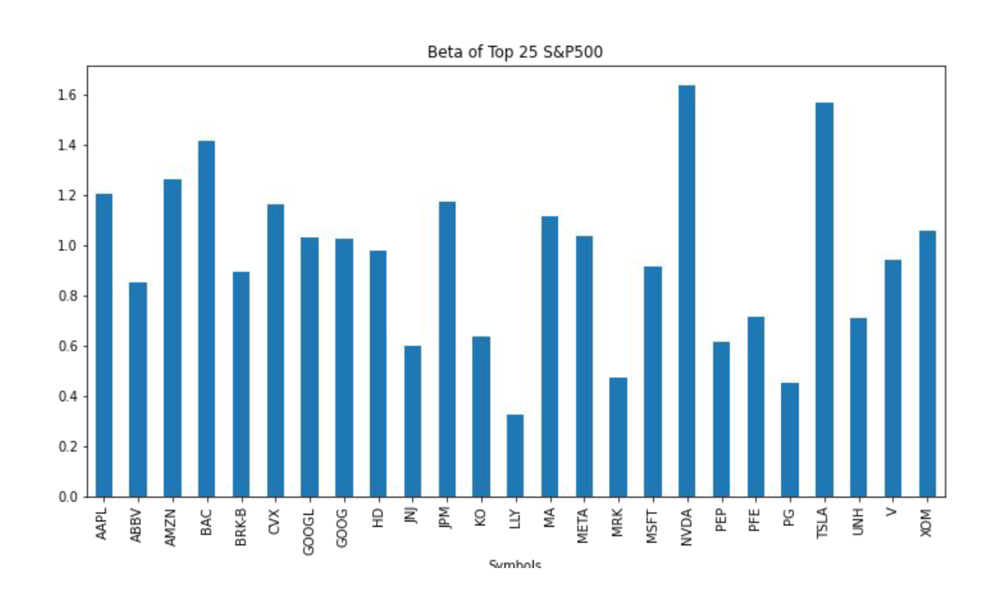

# Developing an Investment Portfolio Utilizing Machine Learning

  

## Table of Contents:

1. [Summary](#summary)

2. [Data Techniques](#data-techniques)

3. [Portfolio Allocation](#portfolio-allocation)

4. [Analysis](#analysis)

 

## Summary

Initial Goal:

`Our initial project goal was to create a chatbot utilizing Machine Learning that generates an investment portfolio based off of the user's age and risk tolerance.`

Revised Goal: 

`Due to time constraints we narrowed down the scope of the project to developing an investment portfolio that utilizes Machine Learning.`

Step 1 : Determining portfolio allocation using Rule of 110 

* The Rule of 110 is a rule of thumb that says the percentage of your money invested in stocks should be equal to 110 minus your age. For example, if you are 30 years old the Rule of 110 states you should have 80% of your buying power in stocks and the rest in bonds.

    * For the purposes of our project, we decided to also include cryptocurrencies, specifically Bitcoin & Ethereum (two largest cryptocurrencies by marketcap).
  
    * Assets chosen to be included in portfolio:
      * Top 25 SP500 Stocks (ranked by marketcap)
      * 30-yr Treasury Bond, 10-yr Treasury Bond
      * Bitcoin, Ethereum

Step 2: Utilize Machine Learning to model Top 25 SP500 stocks for performance in the short-term

* Models: 
  * Facebook's Prophet Model 
  * Logistic Regression Model
  * Decision Tree Regressor Model 

Step 3: Monte Carlo projections for stock portfolio performance over the long-term

* We decided to also include long-term projections to furthur analyze the portfolio

## Data Techniques 

Data Sources: Yahoo Finance API, U.S. Bureau of Labor Statistics, CoinCodex 

* 5-10 years of historical data 
* Needed contemporaneous independent features (CPI & Unemployment Data) for our Machine Learning models

## Portfolio Allocation 

As a team, we decided to include 3 different portoflio types: 
* Aggressive
* Moderate
* Conservative

`This was originally going to be implemented into a chatbot, and if we had more time to work on the project, we would focus on creating a UI where the user can select a portfolio type and generate a weighted portfolio based off of the Rule of 110.`

How did we pick assets for each portfolio type? 

* Expected Return vs Risk utilizing Modern Portfolio Theory
* Sharpe Ratios 
* Beta 

 

* The modern portfolio theory (MPT) is a practical method for selecting investments in order to maximize their overall returns within an acceptable level of risk.

 

 

* Each of the stocks chosen had sharpe ratios above 0.6 (up to 1.2 for NVDA and TSLA).

  * Usually, any Sharpe Ratio greater than 1 is considered a good investment meaning it will have better risk-adjusted performance.
  
* The beta of each of the stocks was near 1.0, indicating that the stocks in the portfolio are somewhat volatile and that the price of the stocks move with the overall market.

## Analysis

* We first tested out the Logistic Regression and Decision Tree Regressor Models to select next day stock forecasts based on both historical stock data only and based on additional CPI and Unemployment data. The results were nearly the same. 

Logistic Regression Model w/ Lagged Closing Price Data Only: 

* Accuracy Score of 0.481081

Logistic Regression Model w/ Lagged Closing Price Data, CPI, & Unemployment Data: 

* Accuracy Score of 0.496753

Independent economic data did not impact the model in any meaningful way.

Decision Tree Regressor Model utilizing CPI and Unemployment Data: 

* Accuracy Score of 0.496753

Decision Tree Regressor and Logistic Regression may be helpful when determining price action in the short-term. However, we examined that Facebook's Prophet Model yields more meaningful results.

 

* Based off of the RMSE scores above, we can see that the values increase dramatically from Day 1 to 30 meaning the Prophet Model starts to become blurry as time goes on. Based off of our analysis we realized that for most machine learning models, long-term forecasting does not provide much value due to a number of reasons, mainly due to the fact that historical data is not enough to determine future prices. Other metrics should be taken into account such as sentiment analysis, technical analysis, and fundamental analysis.

* After running and evaluating our Prophet Model, we decided to implement a Monte Carlo forecast to see if we could generate more useful results. 

  * A Monte Carlo Simulation was more helpful in calculating expected returns over a 5-year period of the defined portfolio with a 95% confidence interval. 
  

 

## Conclusion: 

* Our intial goal was to generate an investment portfolio given a users age and risk tolerance. However, we narrowed down our scope to creating an investment portfolio utilizing Machine Learning Models and traditional financial metrics. Overall, Facebook's Prophet Model generates slightly accurate forecasts in the short-term but starts becoming hazy as time goes on. The Monte Carlo Simulation provided more results and showed the overall growth of each of the portfolio types. 